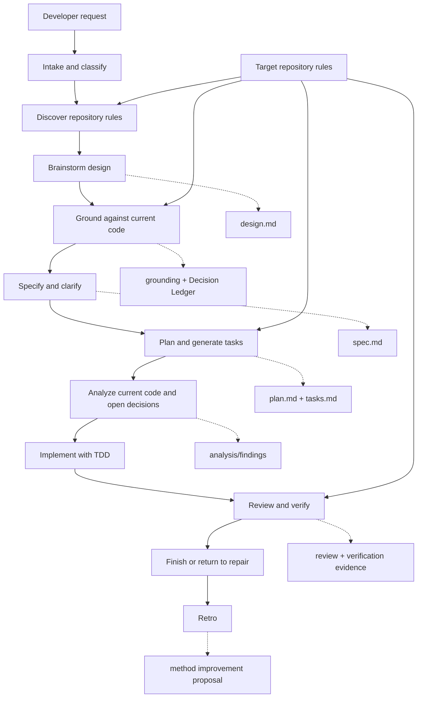

# Devarm Purpose and Evolution — Design

**Document type:** Design spec (devarm-brainstorm output)
**Date:** 2026-08-12
**Status:** complete
**Track:** standard
**Pipeline:** brainstorm ☑ ground ☑ spec ☑ clarify ☑ plan ☑ tasks ☑ analyze ☑ implement ▶ review ☐ finish ☐
**Phase:** design
**Feature/change:** Devarm purpose and evolution
**Last verification:** 2026-08-13 — 85 tests passed; design/spec/plan/tasks/analysis validator checks returned `valid: true`; `git diff --check` passed.
**Open assumptions / risks:** Source-rule adoption is recorded in the matrix below; no unresolved design decision remains. Review findings F1–F3 and F5 require remediation before finish.
**Next gate:** `devarm-implement` to address review findings.
**Target repository:** `/Users/dphadatare/vhosts/devarm`
**Target branch:** `001-devarm-purpose-evolution`
**Last session note:** T001–T016 and the devarm-analyze re-gate are complete on the feature branch; the next phase is review.
**Rule inventory:** This document's `## Repository Rule Inventory` section
**Tasks:** [`docs/specs/devarm-purpose-and-evolution/tasks.md`](../specs/devarm-purpose-and-evolution/tasks.md)
**Analysis:** [`docs/specs/devarm-purpose-and-evolution/analysis.md`](../specs/devarm-purpose-and-evolution/analysis.md)
**Related artifacts:** `AGENTS.md`, `README.md`, `USER_GUIDE.md`, `skills/devarm-*`, `templates/`, the linked spec/plan/tasks, `analysis.md`, and `findings.md`.
**Builds on / related:** `AGENTS.md`, `README.md`, existing `skills/devarm-*`, `templates/`, and `docs/specs/devarm-purpose-and-evolution/spec.md`

---

## 1. Problem statement

AI-assisted software work often fails before or around implementation: the request is
ambiguous, repository rules are missed, existing consumers are not traced, implementation
decisions are made silently, and green tests can coexist with unwired or inert behavior.

Devarm exists to make consequential repository changes grounded, decision-complete, testable,
reviewable, recoverable, and safely integrated. It is a portable development method expressed
through Agent Skills and repository-local artifacts, not a hosted service, code generator, or
replacement for a target repository's own rules.

The flagship workflow is a developer collaborating with an AI agent on a consequential change
in an existing software repository.

## 2. Goals and non-goals

### Goals

| ID | Goal |
|----|------|
| G1 | Keep devarm method-first, portable, and independent of a required CLI, service, database, or agent vendor. |
| G2 | Preserve the existing gated pipeline while making phase state, decisions, evidence, and handoffs durable and resumable. |
| G3 | Discover and visibly apply target-repository rules; target rules take precedence over devarm defaults. |
| G4 | Prevent silent design decisions through a Decision Ledger with explicit user/agent ownership. |
| G5 | Add lightweight deterministic validators for artifact completeness and safety conditions without replacing engineering judgment. |
| G6 | Scale process depth by risk through quick and standard tracks without skipping safety gates. |
| G7 | Preserve partial progress and unrelated worktree changes, and require evidence before completion claims. |
| G8 | Support optional adapters for Spec Kit, project-specific skills, and agent tools without making them dependencies. |
| G9 | Improve devarm itself through retrospectives grounded in recurring failures and verification evidence. |

### Non-goals

- Build a hosted devarm orchestration service or mandatory database.
- Replace repository-specific architecture, CI, security, or product rules.
- Replace GitHub, Jira, CI, Spec Kit, or domain-specific investigation skills.
- Apply the full pipeline to trivial questions, simple documentation edits, or ordinary exploration.
- Commit, push, merge, delete, reset, or discard work without explicit developer authorization.
- Make the method specific to Tech Catalyst, Python, React, a database, or a deployment platform.
- Treat conversation-only decisions as durable project state.

## 3. Approach

Use the existing devarm skills and Markdown artifact model as the canonical method, then add
lightweight, deterministic checks around the artifacts and phase transitions. Extend existing
design, specification, plan, task, analysis, review, and retro documents rather than creating a
parallel planning system.

The target repository remains the source of truth for application rules. Devarm discovers those
rules, classifies their applicability, and records how they governed the change. Devarm defaults
apply only where the target repository has no stronger equivalent.

### Rejected alternatives

- **Markdown-only guidance with no deterministic checks** — maximally simple, but important gates
  can be skipped or interpreted inconsistently.
- **Full devarm orchestration product** — could automate more state and execution, but would add
  coupling, reduce portability, and exceed the method's purpose.
- **Copy Tech Catalyst rules into core devarm** — would make project-specific paths and
  technologies non-portable and would conflict with the target-rule precedence model.

## 4. Architecture

### 4.1 Flow



Every phase reads the previous artifact and current repository state, writes or updates a
durable artifact, records its status and evidence, and stops at its gate unless continuation is
explicitly authorized.

### 4.2 Components

| Component | Location | Responsibility |
|-----------|----------|----------------|
| Method instructions | `AGENTS.md` and `skills/devarm-*` | Define portable phases, authority, gates, and decision ownership. |
| Phase artifacts | Target repository `docs/`, `specs/`, or configured locations | Preserve design, requirements, plans, tasks, findings, and evidence. |
| Rule inventory | Grounding/planning/review artifacts | Record target rules, applicability, enforcement, and evidence. |
| Decision Ledger | Design artifact, then linked artifacts | Record load-bearing decisions, owner, alternatives, evidence, and status. |
| Deterministic validators | Optional repository-local scripts or adapter checks | Validate artifact shape, status, placeholders, mappings, and evidence. |
| External adapters | Optional tool/project integration | Reuse templates or domain workflows without replacing native devarm gates. |

### 4.3 Data and state

Repository-local Markdown artifacts are the source of truth. No separate hosted state store is
required. Each canonical artifact carries common metadata:

- Repository and branch.
- Feature or change name.
- Current pipeline phase.
- Status: `draft`, `awaiting approval`, `in progress`, `blocked`, `partially completed`, or
  `complete`.
- Last verification date and command.
- Open assumptions and risks.
- Next gate and related artifacts.

The existing artifact types remain canonical:

| Phase | Canonical artifact | Responsibility |
|---|---|---|
| Brainstorm/Ground | `design.md` | Purpose, scope, architecture, grounding evidence, Decision Ledger |
| Specify/Clarify | `spec.md` | Testable behavior, scenarios, success criteria, clarifications |
| Plan | `plan.md` | File map, integration seams, migrations, configuration, verification approach |
| Tasks | `tasks.md` | Dependency-ordered tests-first execution units |
| Analyze | `docs/specs/<feature>/analysis.md` | Current-code revalidation, flagship trace, remaining decisions |
| Review/Finish | Review/findings artifact | Findings disposition, verification evidence, integration status |
| Retro | Retro report | Lessons and proposed improvements to devarm |

## 5. Error handling and completion semantics

### Phase failures

- Stop at the failing gate.
- Preserve artifacts, decisions, evidence, and authorized code changes.
- Mark the phase `failed`, `blocked`, or `partially completed`.
- Record what succeeded, what failed, and the next safe action.
- Re-check branch, worktree, rules, and changed files before resuming.
- Never silently retry, roll back, delete, or discard work.

### Authority and worktree safety

- Read-only inspection and local verification may run automatically.
- Planning artifacts may be created or updated during their phase.
- Production changes begin only after design approval and implementation-gate completion.
- Commit, push, merge, delete, reset, and discard actions require explicit approval; destructive
  actions require typed confirmation.
- Unrelated tracked and untracked work must be preserved.
- Consequential changes use an isolated worktree when the active checkout is dirty or unsafe.

### Completion

Completion requires a verification matrix connecting:

```text
requirement -> behavior -> test/check -> actual evidence -> result
```

No completion claim is valid without current command output or equivalent evidence. When a seam
is mocked in a way that prevents the claimed behavior from being exercised, completion is
provisional until a real seam check, integration test, or live smoke establishes the claim.

## 6. Testing and validation

### Human-judgment gates

Skills handle design quality, scope, trade-offs, architecture reasoning, user approval, and
interpretation of repository-specific rules.

### Deterministic validation

Lightweight validators may block a phase when they detect:

- Missing required artifact sections or metadata.
- Unresolved placeholders or empty required decisions.
- Missing decision ownership or evidence.
- Requirements without mapped scenarios, tests, or verification steps.
- Tasks without tests-first ordering where required.
- Missing rule inventory or handoff status.
- Completion claims without verification evidence.

Validators must not attempt to replace engineering judgment or become a full workflow engine.

### Risk-based quality coverage

Each design classifies security, performance, reliability, accessibility, observability,
compatibility, and other relevant dimensions as:

- Required and tested.
- Relevant but deferred with a recorded risk.
- Not applicable, with a reason.

## 7. Interaction and extensibility

Devarm asks one consequential design question at a time, leads with a recommendation, explains
trade-offs plainly, and batches independent implementation decisions. Silence is never approval.
When a settled decision changes, the old decision is superseded and dependent artifacts receive a
ripple check.

The native core owns brainstorming, grounding, specification, clarification, planning, tasks,
analysis, implementation, debugging, review, finish, and retro. Optional adapters may provide
Spec Kit templates, project-specific skills, repository validators, or tool integrations. Their
use is recorded in a method inventory and cannot silently bypass native gates.

## 8. Success criteria

Devarm succeeds when:

- Every consequential change has a grounded design and decision record.
- Every requirement maps to a test or explicit verification step.
- Repository-specific rules are discovered and visibly applied.
- Implementation does not begin with unresolved design-level decisions.
- Completion claims include real verification evidence.
- Interrupted work can resume without re-deriving the whole design.
- Unrelated worktree changes are preserved.
- The method works across supported agent tools without a required service.
- Recurring failures result in concrete, verified devarm improvements.

## 9. Resolved implementation details

The implementation choices formerly listed as open are resolved in D21–D34: structured Markdown
metadata, standard-library validator placement and interface, native-versus-adapter ownership,
`docs/specs/<feature>/analysis.md`, the first validator/test set, sequential TDD execution, the
feature-branch precondition, and retro-owned changelog history. No implementation-level decision
is awaiting confirmation.

## 10. Method inventory

| Item | Native/external | Used? | Artifact/output | Reuse next time |
|---|---|---:|---|---|
| `devarm-brainstorm` | Native | Yes | This design document and section-by-section decisions | Use for future method changes |
| `devarm-ground` | Native | Yes | Grounded design and Decision Ledger | Required before approval |
| Spec Kit | External adapter | No | N/A; devarm has no `.specify/` directory | Use only when a target repository provides it |
| Superpowers brainstorming | External adapter | No | N/A; its recommendation-first behavior is already represented in devarm | Keep as optional reference |
| Tech Catalyst `.cursor/rules/` | External source-rule reference | Reference only | Read and mapped below; never copied as target-repository runtime rules | Portable principles may be adopted; stack-specific rules remain target-repository rules |

---

<!-- Grounded by devarm-ground before the approval gate. -->

## Detailed Design (grounded)

### Grounding scope and current repository rules

The current devarm repository has `AGENTS.md`, the native phase skills, templates, `README.md`,
and `install.sh`. The repository scan found no `.specify/` directory and no `.cursor/rules/`
directory; the existing `.cursor/` content is a conversation record, not an applicable rule
source. Therefore this design is governed by `AGENTS.md` and the devarm skills/templates, with
no project-specific constitution override discovered in this checkout.

### Repository Rule Inventory

| ID | Source | Scope | Applies | Precedence | Enforcement phase | Evidence | Conflict/disposition |
|---|---|---|---|---|---|---|---|
| R1 | `AGENTS.md` | Devarm pipeline, authority, decision ownership, evidence, portability | Yes | Authoritative native method rule | All phases | `AGENTS.md:11-155` | Governs this method change |
| R2 | `skills/devarm-*` | Native phase contracts and gates | Yes | Authoritative phase guidance | Relevant phase | `skills/devarm-brainstorm/SKILL.md:40-100` and phase skill metadata | Extend without bypassing existing gates |
| R3 | `templates/*` | Artifact structures and ledger rules | Yes | Authoritative artifact fallback | Artifact-producing phases | `templates/design-doc.md:1-78`, `templates/decision-ledger.md:1-52` | Extend existing templates; preserve canonical artifacts |
| R4 | `README.md` | Public usage and portability documentation | Yes | Documentation contract | Plan/review/finish | `README.md:39-110` | Update with the new optional validator contract |
| R5 | `.cursor/rules/` | Target-repository rule files | No | Not applicable | N/A | Repository scan recorded at `docs/design/2026-08-12-devarm-purpose-and-evolution-design.md:264-267` | No project-specific Cursor rules in devarm |
| R6 | `.specify/` | Spec Kit project configuration and constitution | No | Not applicable | N/A | Repository scan recorded at `docs/design/2026-08-12-devarm-purpose-and-evolution-design.md:264-267` | Use native templates |
| R7 | `install.sh` | Cross-tool skill installation | Yes | Installation compatibility | Finish/release | `install.sh:42-96` | Do not make the optional validator a required installed skill |

### Source-rule adoption matrix

The user-cited Tech Catalyst rules were read at
`/Users/dphadatare/vhosts/tech-catalyst-v2/.cursor/rules/`. Devarm adopts portable engineering
principles into its native method/templates; technology-, path-, and project-specific conventions
remain target-repository rules or optional adapters.

| Source rule | Disposition | Adopted/adapted principle | Explicitly excluded from devarm core | Native home / enforcement |
|---|---|---|---|---|
| `architecture-boundaries.mdc` | Adapt | Dependency direction, thin boundary handlers, neutral shared contracts | Python backend paths and `DurableWorkflow`/DBOS specifics | `templates/constitution.md`, `code-standards.md`; ground/plan/review |
| `backend-conventions.mdc` | Adapt | Repository-owned data access, caller-owned transaction, typed boundary DTOs, one config home | SQLAlchemy, Pydantic, `backend/` paths, and client names | `templates/code-standards.md`; target rules enforce stack details |
| `design-patterns.mdc` | Adopt + adapt | Repository/store, ports and adapters, composition, DTOs, dependency injection, anti-pattern checks | React/TypeScript and framework-specific examples as core requirements | `templates/code-standards.md`; ground/implement/review |
| `design-principles.mdc` | Adopt + adapt | Cohesion, file-size/god-file budgets, dependency direction, no dead code/duplication | Tech Catalyst known god-file paths and stack-specific budgets | `templates/constitution.md`; design/plan/review |
| `frontend-conventions.mdc` | Target-only adapter | Preserve typed boundary and thin UI concepts when a target project applies them | React Query, axios, `frontend/src/` paths, and TypeScript-only rules | Target `.cursor/rules/` / project constitution |
| `no-half-finished-refactors.mdc` | Adopt | Complete migrations, one source of truth, no orphaned or staged-for-later modules | Tech Catalyst debt list and project-specific TODO paths | `templates/constitution.md`, `code-standards.md`; ground/review |
| `specify-rules.mdc` | Target-only adapter | Consume project-provided planning context through the rule inventory | Tech Catalyst `specs/001-*` paths and Spec Kit project assumptions | Target `.cursor/rules/` / optional Spec Kit adapter |

Decision D26 records this disposition as the approved adoption boundary.

The current method already establishes the pipeline and artifact/gate contract in
`AGENTS.md:11-31`, the skill invocation preamble and target-rule precedence in
`AGENTS.md:33-44` and `AGENTS.md:133-138`, and cross-tool installation through symlinked skills in
`AGENTS.md:148-155` and `install.sh:42-75`. The proposed validators, common metadata contract,
partial-status semantics, and rule-applicability matrix are new capabilities; they are not
claimed to exist in the current tree.

### Layer and boundary legality

This is a method-repository change, not an application-runtime change. Existing method
instructions remain in `AGENTS.md` and `skills/devarm-*`; reusable artifact structures remain in
`templates/`; installation remains in `install.sh`. No application import graph, persistence
layer, or external service is introduced. Future validators must be separate from the skills'
instruction content and must not become a required runtime dependency for the method.

### Artifact identity, persistence, and consumer audit

The canonical identity of a change is the path to its governing design document, with repository
and branch as execution context. Every later artifact links back to that design path; no new
global feature-ID service is introduced. This extends the existing pipeline/last-session anchor
in `templates/design-doc.md:3-12` and the one-canonical-planning-system rule in
`AGENTS.md:140-146`.

State persists as repository-local Markdown. There is no database, migration, or new persistence
shape. Existing consumers are the phase skills: brainstorm writes the design
(`skills/devarm-brainstorm/SKILL.md:80-89`), ground reads and appends grounding/ledger content
(`skills/devarm-ground/SKILL.md:27-33`, `skills/devarm-ground/SKILL.md:128-130`), spec/plan/tasks
consume the preceding artifacts (`skills/devarm-spec/SKILL.md:10-23`,
`skills/devarm-plan/SKILL.md:21-36`, `skills/devarm-tasks/SKILL.md:14-29`), analyze re-reads
design/spec/plan/tasks (`skills/devarm-analyze/SKILL.md:28-41`), and implement/review use the
grounded design and ledger (`skills/devarm-implement/SKILL.md:23-29`,
`skills/devarm-review/SKILL.md:14-35`). The change preserves those artifact names and phase
relationships while adding common metadata and rule inventory requirements.

### Exact seams and determinism

The method's existing seam is the phase handoff, not a code import: each skill reads the previous
artifact and reports a next phase. The phase order is fixed in `AGENTS.md:17-31`; design documents
already carry a pipeline marker and last-session note in `templates/design-doc.md:3-10`.

Validators will be read-only and rerunnable. Their identity is the artifact path plus validator
version/rule set; they must produce the same result for the same artifact and repository state.
They must not mutate production code, create duplicate planning systems, or infer approval from
absence of a user response. Exact validator placement and implementation language remain
implementation details for `devarm-plan`.

### Backward compatibility and migration

Existing skill names, phase order, artifact types, installation destinations, and explicit-commit
policy remain compatible with `AGENTS.md:17-31`, `AGENTS.md:60-94`, and `install.sh:42-96`.
Historical artifacts will not be rewritten in bulk. New artifacts and artifacts resumed at a
future gate must satisfy the common metadata/rule-inventory contract; a migration task may add
metadata when an existing feature resumes. No parallel planning format is introduced.

### Failure and completion posture

The current method already requires phase gates, explicit continuation, and no silent approval
(`AGENTS.md:54-63`, `AGENTS.md:96-111`). Implementation already requires a clean analyze gate,
feature branch, design-anchor replay, and current-code revalidation before coding
(`skills/devarm-implement/SKILL.md:14-34`). It also requires fresh verification and explicit
commit permission (`skills/devarm-implement/SKILL.md:55-109`). The design strengthens this with
explicit `blocked`, `failed`, and `partially completed` statuses, preserved artifacts, and
resume-time revalidation. Dirty-worktree isolation is already supported as an option in
`skills/devarm-implement/SKILL.md:181-183`; making it the default for unsafe consequential work
is a proposed strengthening, not current universal behavior.

### Limits and configuration semantics

The quick-track boundary is at most three changed files with no persistence or contract change,
enforced during brainstorming; widening scope upgrades to standard track
(`skills/devarm-brainstorm/SKILL.md:50-63`). The native clarification gate allows at most five
accepted questions before handoff (`skills/devarm-clarify/SKILL.md:87-93`). At those limits,
quick-track work upgrades rather than bypasses gates, and clarification stops with remaining risk
logged. These are method-level fixed limits, not per-repository application settings. No new
numeric validator limit is introduced by this design.

### Runtime contract surfaces

`AGENTS.md`, `README.md`, `USER_GUIDE.md`, each `SKILL.md`, and the templates are runtime guidance consumed by agents. The
pairing rule is already explicit for prompts and skills in `AGENTS.md:120-123`; future changes
must update the relevant skill, `AGENTS.md`/`README.md` references, templates, and deterministic
checks together. No application prompt, model output contract, or external API is changed by this
design. The method inventory records external adapters, while native devarm gates remain
authoritative (`AGENTS.md:40-44`).

### Grounding disposition

All reuse claims in this design are now grounded against the current devarm tree. Proposed
validators, common artifact metadata, partial-status semantics, and rule-applicability matrices
are explicitly marked as new capabilities. No illegal import, persistence migration, external
runtime dependency, or existing dead module is being reused.

## Decision Ledger

| # | Decision | Alternatives rejected | Evidence (file:line / rule) | Owner | Tier | Status |
|---|----------|-----------------------|------------------------------|-------|------|--------|
| D1 | Method-first product with lightweight deterministic validators | Markdown-only; full orchestration service | User-approved design direction; current method is skills + Markdown: `AGENTS.md:3-8`, `README.md:3-10` | user | design | approved |
| D2 | Flagship workflow is consequential change in an existing repository | Greenfield-first; equal priority for all work types | Current invocation scope: `AGENTS.md:45-53`, `AGENTS.md:64-75` | user | design | approved |
| D3 | Preserve progress and support resumption after failure/interruption | Silent rollback; discard partial output | Existing resume discipline: `skills/devarm-brainstorm/SKILL.md:163-170`, `skills/devarm-implement/SKILL.md:17-24` | user | design | approved |
| D4 | Repository-local artifacts are the source of truth | Global state store; hosted database | Existing artifact-oriented method: `README.md:3-10`, `templates/design-doc.md:1-7` | user | design | approved |
| D5 | Target repository rules take precedence over devarm defaults | Copy project rules into core; silently choose on conflict | `AGENTS.md:133-134`, `skills/devarm-ground/SKILL.md:29-33` | user | design | approved |
| D6 | Safe local automation, explicit lifecycle authority | Autonomous commit/merge/push/reset | `AGENTS.md:60-63`, `skills/devarm-finish/SKILL.md:35-72` | user | design | approved |
| D7 | Adaptive quick and standard tracks | Full pipeline for every task | `AGENTS.md:45-53`, `skills/devarm-brainstorm/SKILL.md:51-64` | user | design | approved |
| D8 | No required CLI, service, or database | Mandatory runtime/orchestrator | Portability model: `README.md:10-19` | user | design | approved |
| D9 | Durable phase artifacts and Decision Ledger | Conversation-only state; parallel planning system | `templates/design-doc.md:1-7`, `AGENTS.md:142-145` | user | design | approved |
| D10 | Hard gates for safety, grounding, unresolved design decisions, and verification | Advisory-only process | `AGENTS.md:54-59`, `AGENTS.md:67-89`, `AGENTS.md:135-138` | user | design | approved |
| D11 | Native core with optional adapters | Mandatory external framework | `AGENTS.md:40-44`, `README.md:107-110` | user | design | approved |
| D12 | Risk-based quality coverage | Boilerplate checks for every change | `skills/devarm-brainstorm/SKILL.md:115-118` | user | design | approved |
| D13 | Recommendation-first, one-question-at-a-time decision protocol | Silent defaults; unstructured questionnaires | `skills/devarm-brainstorm/SKILL.md:122-152` | user | design | approved |
| D14 | Partial completion is preserved and explicitly marked | Treat partial output as complete; automatic discard | Current durable phase marker exists in `templates/design-doc.md:3-10`; explicit partial semantics are a new behavior approved in this design | user | design | approved |
| D15 | Dirty worktrees are protected; isolate consequential changes | Broad restore/reset; edit through unrelated changes | Existing optional isolation and clean-baseline rule: `skills/devarm-implement/SKILL.md:181-183`; defaulting unsafe consequential work to isolation is a proposed strengthening | user | design | approved |
| D16 | Current code, commands, runtime, and CI evidence outrank stale summaries | Documentation-only assertions | Evidence principles: `AGENTS.md:115-128` | user | design | approved |
| D17 | Human judgment in skills; deterministic checks in validators | Full automated orchestration; uncheckable prose gates | Procedural-gate principle: `AGENTS.md:135-138` | user | design | approved |
| D18 | Success is measured by grounded, testable, resumable, portable work | Speed-only or artifact-count metrics | User-approved success criteria; current gated pipeline: `AGENTS.md:19-32` | user | design | approved |
| D19 | Change identity is the governing design-document path plus repository/branch context | Global feature-ID service; conversation-only identity | Design pipeline and last-session anchor: `templates/design-doc.md:3-12`; one canonical planning system: `AGENTS.md:140-146` | agent | impl | approved |
| D20 | Preserve existing artifact names and phase relationships; migrate metadata only when artifacts are resumed | Bulk rewrite; parallel artifact format | Current phase artifact contract: `AGENTS.md:17-31`; no bulk migration is required | agent | impl | approved |
| D21 | Use structured Markdown headings and bold metadata fields, not front matter | YAML front matter; separate database state | Preserves tool portability and matches `templates/design-doc.md:1-12`; no YAML parser is required | agent | impl | approved |
| D22 | Keep the canonical rule inventory in the design and link downstream artifacts to it, adding only phase-specific deltas | Duplicate the full table in every artifact; global rule database | Avoids drift while satisfying the rule-inventory component and one-canonical-planning-system rule: design `docs/design/2026-08-12-devarm-purpose-and-evolution-design.md:109-118`, `AGENTS.md:140-146` | agent | impl | approved |
| D23 | Implement the optional validator as a standard-library-only Python script under `scripts/` | Mandatory CLI package; shell-only parser; hosted service | Supports deterministic parsing/tests without adding dependencies or making Python a devarm runtime requirement: design `docs/design/2026-08-12-devarm-purpose-and-evolution-design.md:276-282`, spec `docs/specs/devarm-purpose-and-evolution/spec.md:288-314` | agent | impl | approved |
| D24 | Treat validator errors as blocking and warnings as reported limitations | Make all findings blocking; make all findings advisory | Separates deterministic safety failures from unavailable optional tooling and judgment-required decisions: design `docs/design/2026-08-12-devarm-purpose-and-evolution-design.md:186-198` | agent | impl | approved |
| D25 | Do not modify `install.sh` to distribute the validator | Install the helper into every target project; require global executable discovery | Preserves skill-only installation compatibility while validators remain optional repository-local helpers: `install.sh:42-75`, design `docs/design/2026-08-12-devarm-purpose-and-evolution-design.md:276-282` | agent | impl | approved |
| D26 | Adopt portable principles from the user-cited source rules; keep stack/path-specific rules external | Copy all Tech Catalyst rules into devarm; reject all source guidance | Source-rule adoption matrix above; existing portable equivalents in `templates/constitution.md:7-35` and `templates/code-standards.md:11-42` | user | design | approved |
| D27 | Quick track means at most three changed files, with no persistence or contract change | Approximate threshold; full pipeline for every small change | Current quick-track wording and upgrade behavior: `skills/devarm-brainstorm/SKILL.md:50-63`; hard-number principle in `AGENTS.md:118-128` | user | design | approved |
| D28 | Persist analyze output at `docs/specs/<feature>/analysis.md` | Chat-only report; global analysis database | AGENTS phase-artifact rule and design artifact table: `AGENTS.md:13-29`, design `:140-148` | user | design | approved |
| D29 | Validator accepts artifact path and kind; expected phase is derived from the kind map | Separate repository-root/expected-phase inputs with no CLI/function support | Existing planned CLI/function contract in plan `:120-149` and subprocess seam in tasks T002–T003 | agent | impl | approved |
| D30 | `tasks.md` is the sole executable task source; plan task groups are only a requirement map | Maintain two hand-edited task lists; allow plan/tasks drift | Plan Section 2 and task IDs T001–T016 | agent | impl | approved |
| D31 | Execute tasks sequentially with strict RED → GREEN → refactor → verify checkpoints | Parallel edits across shared contract-test surfaces; batch code before tests | Tasks execution contract and `devarm-implement` TDD loop | agent | impl | approved |
| D32 | Use standard-library subprocess fixtures, including the 20-document performance check | Require a project runner or third-party test dependency | Plan testing contract and tasks T001–T003/T013/T015 | agent | impl | approved |
| D33 | Create a feature branch before the first implementation edit while preserving the current planning changes in this checkout | Accumulate implementation on `main`; discard or reset the planning worktree | `skills/devarm-implement/SKILL.md` precondition 2 and current dirty planning state | agent | impl | approved |
| D34 | Let `devarm-retro` record the method-change entry in `CHANGELOG.md` after implementation/review | Hand-edit changelog during the implementation task sequence | `skills/devarm-retro/SKILL.md:84-87`; `CHANGELOG.md` ownership statement | agent | impl | approved |
