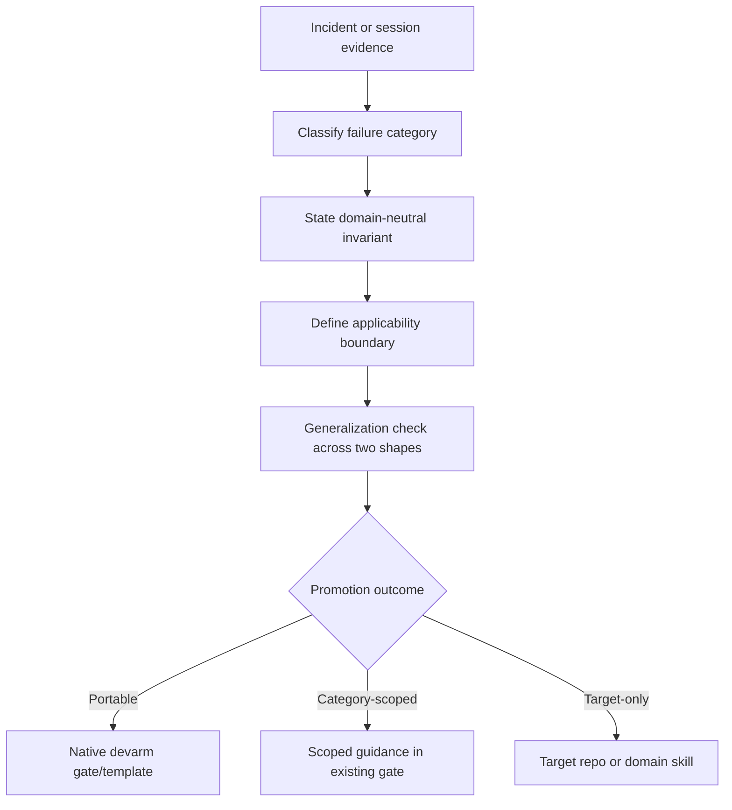

# Retro Generalization Gate — Design

**Document type:** Design spec (devarm-brainstorm output)
**Date:** 2026-08-13
**Status:** approved
**Phase:** design
**Feature/change:** Require devarm retros to promote reusable categories, not case-specific fixes
**Track:** standard
**Pipeline:** brainstorm ▶ ground ☑ spec ☐ clarify ☐ plan ☐ tasks ☐ analyze ☐ implement ☐ review ☐ finish ☐
**Last session note:** User approved the design and requested a repository-wide audit of retro-derived skill wording.
**Last verification:** N/A before implementation
**Open assumptions / risks:** Existing uncommitted method-evolution changes are unrelated work and must be preserved.
**Next gate:** devarm-spec after the audit scope is confirmed
**Target repository:** /Users/dphadatare/vhosts/devarm
**Target branch:** 001-devarm-purpose-evolution
**Related artifacts:** `skills/devarm-retro/SKILL.md`, `tests/test_method_contracts.py`, `CHANGELOG.md`
**Rule inventory:** Repository rules are summarized in Section 7.
**Analysis:** N/A until implementation analysis phase

**Builds on / related:** Existing portable-method design and source-rule adoption boundary in `docs/design/2026-08-12-devarm-purpose-and-evolution-design.md`.

---

## 1. Problem statement

Devarm's retro is intended to turn a failure into a reusable method improvement, but its current
contract validates evidence and recurrence without requiring the proposed rule to be stated at a
portable abstraction level. A Tech Catalyst incident can therefore become a devarm rule whose
wording, trigger, or enforcement assumes that product.

The incident remains valid evidence. The defect is promoting the incident itself instead of the
failure category or invariant it demonstrates.

## 2. Goals and non-goals

### Goals

| ID | Goal |
|----|------|
| G1 | Require each proposed method change to name a reusable failure category or invariant. |
| G2 | Separate incident/repository evidence from the portable normative rule. |
| G3 | Require an applicability boundary and a generalization check before promotion. |
| G4 | Preserve a path for category-scoped guidance when a rule is reusable but not universal. |
| G5 | Lock the contract with repository-level tests without introducing runtime dependencies. |
| G6 | Remove case-specific incident narratives from normative skill instructions while preserving their historical evidence in `CHANGELOG.md`. |

### Non-goals

- Rewrite historical changelog entries.
- Remove Tech Catalyst examples from historical evidence.
- Create a domain-taxonomy service or automated classifier.
- Change the devarm pipeline gates outside the retro contract and its documentation tests.
- Delete valid generic guidance merely because its motivating incident came from Tech Catalyst.

## 3. Approach

Add a mandatory “generalize before promotion” check to `devarm-retro`. Each proposed change must
record: the failure category, the domain-neutral invariant, the enforcement point, the
applicability boundary, and a generalization check across at least two repository/domain shapes.

As part of the same change, audit every `skills/devarm-*/SKILL.md`. Normative instructions will
retain generic examples where they clarify a rule, but incident identifiers, product names,
repository-specific paths, and postmortem narratives will be removed or rewritten into generic
failure-class language. The changelog remains the provenance record.

The existing evidence threshold remains: recurring evidence (at least two occurrences) or one
severe failure. The new check controls abstraction quality; it does not replace evidence.

**Recommended promotion outcomes:**

- **Portable core:** applies across repository and domain shapes; promote into native devarm.
- **Category-scoped:** reusable within a named class of systems; add to an existing gate with an
  explicit applicability boundary.
- **Target-only:** specific to a product, repository, framework, or workflow; keep it in the
  target repository or domain skill.

**Rejected alternatives:**

- **Reject all domain evidence** — loses the real incidents that reveal method weaknesses.
- **Keep the current evidence-only contract** — permits case-specific rules to continue entering
  the portable core.
- **Add a fully automated taxonomy/classifier** — unnecessary complexity; the judgment is a
  design decision that should remain reviewable.

## 4. Architecture

### 4.1 Flow

### 4.2 Components

| Component | Location | Responsibility |
|-----------|----------|----------------|
| Retro contract | `skills/devarm-retro/SKILL.md` | Procedurally require category, invariant, boundary, and generalization evidence. |
| Contract regression tests | `tests/test_method_contracts.py` | Verify the retro skill and portable documentation expose the new contract. |
| Method history | `CHANGELOG.md` | Record the motivation and the portable boundary for this method change. |
| Skill audit | `skills/devarm-*/SKILL.md` | Keep normative guidance domain-neutral and move case evidence to method history. |

### 4.3 Data

No persistence or runtime data shape changes. The retro report gains required conceptual fields;
the exact report format remains Markdown and human-readable.

## 5. Error handling & completion semantics

- If the evidence is only one ordinary incident and no broader class is demonstrated, do not
  promote a method change; record it as a target-specific lesson or defer it.
- If the invariant is reusable only within a category, the proposal must be category-scoped and
  must not be written as universal devarm behavior.
- If the generalization check is absent or only repeats the original product context, the retro
  proposal is incomplete and cannot be presented as a portable method change.
- Historical entries remain unchanged; this gate applies to new retros.

## 6. Testing

- Add a contract test requiring `devarm-retro` to mention the failure category/invariant,
  applicability boundary, generalization check, and portable/category-scoped/target-only outcomes.
- Add a contract test that normative skills do not contain incident identifiers or product-specific
  retro markers such as `Session evidence`, `spec NNN`, `DEV-NNNNNN`, or `PR #N`.
- Extend the existing retro documentation contract test only as needed; do not build a runtime
  taxonomy engine.
- Run the focused method-contract test and the repository's applicable test suite during
  implementation verification.

## 7. Repository Rule Inventory

| Rule | Evidence | Disposition |
|------|----------|-------------|
| Portable core must not silently absorb target-specific rules | `AGENTS.md:42-47` | Adopt; this design makes the boundary procedural for retros. |
| Retro changes require motivating and verification evidence | `skills/devarm-retro/SKILL.md:16-21` | Preserve; generalization is an additional check. |
| Only recurring or severe failures earn method changes | `skills/devarm-retro/SKILL.md:77-83` | Preserve; evidence threshold remains unchanged. |
| Domain skills remain external/project-specific | `skills/devarm-retro/SKILL.md:49-53` | Preserve; target-only outcomes remain outside devarm core. |
| Existing worktree changes must be preserved | `AGENTS.md:42-44`; current `git status` | Adopt; implementation must be narrow and non-destructive. |

## 8. Detailed Design (grounded)

1. **Layer/boundary legality:** This is documentation and contract-test behavior only; no
   application import or runtime boundary changes apply.
2. **Persistence shape:** N/A; no persisted state or artifact schema migration is required.
3. **Canonical identity:** The retro skill remains the canonical home for the rule; README,
   USER_GUIDE, and AGENTS references are supporting documentation only.
4. **Exact seams:** The current retro contract is defined by `skills/devarm-retro/SKILL.md:14-21`
   and its method-contract assertions at `tests/test_method_contracts.py:303-307` and
   `tests/test_method_contracts.py:462-467`.
5. **Determinism:** Tests assert required contract language; human judgment determines whether a
   category is genuinely portable. The test must not pretend to classify domains automatically.
6. **Back-compatibility:** Existing retro evidence, recurrence/severity threshold, method
   inventory, and changelog ownership remain unchanged.
7. **Failure posture:** Missing generalization evidence blocks promotion as a native method
   change but does not erase the retro report or incident evidence.
8. **Unrelated worktree state:** The current checkout contains pre-existing modifications and
   untracked artifacts. Implementation must touch only the approved retro contract, tests, and
   changelog files and must not reset or restore the worktree.
9. **Skill audit boundary:** The audit covers normative `skills/devarm-*/SKILL.md` files. Historical
   incident evidence in `CHANGELOG.md`, design artifacts, and retro reports is not rewritten.
   Generic technical examples remain when they explain a reusable rule without naming a specific
   product, ticket, or incident.

## 9. Decision Ledger

| # | Decision | Alternatives rejected | Evidence | Owner | Tier | Status |
|---|----------|-----------------------|----------|-------|------|--------|
| D1 | Use a generalization gate rather than rejecting domain evidence | Reject all TC/domain evidence; keep evidence-only contract | `skills/devarm-retro/SKILL.md:37-53,77-83` | user | design | approved |
| D2 | Permit portable, category-scoped, and target-only outcomes | Force every lesson into universal core or discard it | `AGENTS.md:42-47`; `skills/devarm-retro/SKILL.md:49-53` | user | design | approved |
| D3 | Require two-shape generalization evidence, judged by the human, not an automated classifier | Taxonomy service; single-example promotion | Portability goal and no-runtime scope | user | design | approved |
| D4 | Keep the change limited to the retro contract, the normative skill audit, tests, and changelog | Rewrite historical entries or broaden unrelated pipeline behavior | Current retro ownership and existing contract tests | user | design | approved |
| D5 | Audit all normative devarm skills and remove case-specific retro markers while retaining generic technical examples | Leave incident narratives in skills; delete all examples indiscriminately | `skills/devarm-*/SKILL.md` audit; `CHANGELOG.md` as historical method record | user | design | approved |
